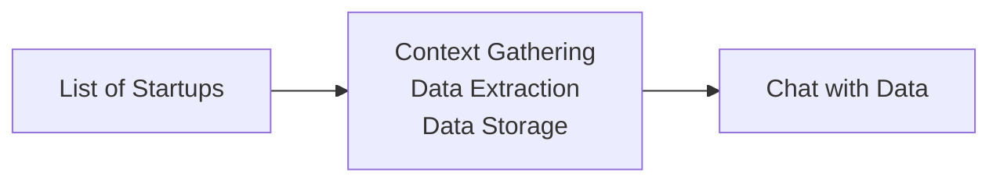

# Technical Documentation

## Overview

`startup-researcher` takes an input `YAML` list of startups (where each startup input is an arbitrary associated string), conducts extensive online research on each startup, stores the results in a local SQLite database, and exposes a chat-with-data interface offering data analytic workflows (e.g. statistic calculations, visualization generation, etc.).



---

## Inputs

`session.yaml` contains a list of startups to research.

```yaml
startups:
  - startup_1   # arbitrary string for startup identification (e.g. "Cursor AI IDE http://cursor.com/" or ""
  - startup_2
  - ...
```

## Data Models

> sqlite database

```python
from pydantic import BaseModel, Field
from typing import List, Optional, Literal
from datetime import date, datetime

class Founder(BaseModel):
    founder_id:            int                       # Auto-increment primary key
    name:                  str                       # Founder name
    background:            Optional[str] = None      # Professional background

class FundingRound(BaseModel):
    funding_round_id:      int                       # Primary key
    round:                 str                       # Round name (e.g., Seed, Series A)
    amount:                Optional[float] = None    # Amount raised
    currency:              str = 'USD'               # Currency of the amount
    date:                  Optional[date] = None     # Date of the funding round
    lead_investor:         Optional[str] = None      # Lead investor name

class Technology(BaseModel):
    technology_id:         int                       # Auto-increment primary key
    name:                  str                       # Technology name
    description:           Optional[str] = None      # Technology description

class Patent(BaseModel):
    patent_id:             int                       # Auto-increment primary key
    patent_number:         str                       # Patent number
    title:                 Optional[str] = None      # Patent title
    filing_date:           Optional[date] = None     # Filing date
    status:                Optional[str] = None      # Patent status

class Product(BaseModel):
    product_id:            int                       # Auto-increment primary key
    name:                  str                       # Product name
    description:           Optional[str] = None      # Product description
    value_proposition:     Optional[str] = None      # Value proposition
    version_number:        int = 1                   # Version number
    is_latest:             bool = True               # Flag for latest version
    sentiment_score:       Optional[float] = None    # Sentiment analysis score
    embedding:             Optional[List[float]] = None  # Semantic embedding vector
    auto_category:         Optional[str] = None      # Auto-classified category
    importance_score:      Optional[float] = None    # Auto-computed importance score
    keywords:              List[str] = []           # Auto-extracted keywords
    raw_extraction:        Optional[dict] = None     # Raw LLM extraction payload
    technologies:          List[Technology] = []     # Associated technologies

class MarketSegment(BaseModel):
    segment_id:            int                       # Auto-increment primary key
    name:                  str                       # Segment name
    description:           Optional[str] = None      # Segment description

class RevenueModel(BaseModel):
    revenue_model_id:      int                       # Auto-increment primary key
    type:                  str                       # Revenue model type (e.g., SaaS)
    description:           Optional[str] = None      # Model description

class PricingStrategy(BaseModel):
    pricing_strategy_id:   int                       # Auto-increment primary key
    strategy:              str                       # Pricing strategy name
    details:               Optional[str] = None      # Strategy details

class GoToMarketChannel(BaseModel):
    channel_id:            int                       # Auto-increment primary key
    channel:               str                       # Channel name
    description:           Optional[str] = None      # Channel description

class Competitor(BaseModel):
    competitor_id:         int                       # Auto-increment primary key
    name:                  str                       # Competitor name
    description:           Optional[str] = None      # Competitor description

class SWOTEntry(BaseModel):
    swot_id:               int                       # Auto-increment primary key
    category:              Literal['Strength','Weakness','Opportunity','Threat']  # SWOT category
    description:           str                       # SWOT description

class PressRelease(BaseModel):
    press_release_id:      int                       # Auto-increment primary key
    version_number:        int = 1                   # Version number
    is_latest:             bool = True               # Flag for latest version
    title:                 str                       # Release title
    url:                   Optional[str] = None      # Release URL
    publication_date:      Optional[date] = None     # Publication date
    summary:               Optional[str] = None      # Release summary
    sentiment_score:       Optional[float] = None    # Sentiment analysis score
    embedding:             Optional[List[float]] = None  # Semantic embedding vector
    auto_category:         Optional[str] = None      # Auto-classified category
    importance_score:      Optional[float] = None    # Auto-computed importance score
    keywords:              List[str] = []           # Auto-extracted keywords
    raw_extraction:        Optional[dict] = None     # Raw LLM extraction payload

class GrowthMetric(BaseModel):
    metric_id:             int                       # Auto-increment primary key
    metric_name:           str                       # Metric name
    value:                 Optional[float] = None    # Metric value
    unit:                  Optional[str] = None      # Measurement unit
    as_of_date:            Optional[date] = None     # Date of metric
    version_number:        int = 1                   # Version number
    is_latest:             bool = True               # Flag for latest version

class ComplianceNews(BaseModel):
    compliance_id:         int                       # Auto-increment primary key
    title:                 str                       # News title
    url:                   Optional[str] = None      # News URL
    publication_date:      Optional[date] = None     # Publication date
    description:           Optional[str] = None      # News description
    sentiment_score:       Optional[float] = None    # Sentiment analysis score
    embedding:             Optional[List[float]] = None  # Semantic embedding vector
    auto_category:         Optional[str] = None      # Auto-classified category
    importance_score:      Optional[float] = None    # Auto-computed importance score
    keywords:              List[str] = []           # Auto-extracted keywords
    raw_extraction:        Optional[dict] = None     # Raw LLM extraction payload

class Executive(BaseModel):
    executive_id:          int                       # Auto-increment primary key
    name:                  str                       # Executive name
    title:                 Optional[str] = None      # Position title
    achievements:          Optional[str] = None      # Notable achievements

class CultureSignal(BaseModel):
    signal_id:             int                       # Auto-increment primary key
    source:                str                       # Source platform (e.g., Glassdoor)
    signal_type:           Optional[str] = None      # Type (review, blog post)
    content:               str                       # Signal content
    url:                   Optional[str] = None      # Source URL
    sentiment_score:       Optional[float] = None    # Sentiment analysis score
    embedding:             Optional[List[float]] = None  # Semantic embedding vector
    raw_extraction:        Optional[dict] = None     # Raw LLM extraction payload

class Risk(BaseModel):
    risk_id:               int                       # Auto-increment primary key
    description:           str                       # Risk description
    category:              Optional[str] = None      # Risk category
    likelihood:            Optional[str] = None      # Likelihood level
    impact:                Optional[str] = None      # Impact level
    version_number:        int = 1                   # Version number
    is_latest:             bool = True               # Flag for latest version
    raw_extraction:        Optional[dict] = None     # Raw LLM extraction payload

class Opportunity(BaseModel):
    opportunity_id:        int                       # Auto-increment primary key
    description:           str                       # Opportunity description
    recommended_action:    Optional[str] = None      # Recommended next step
    raw_extraction:        Optional[dict] = None     # Raw LLM extraction payload

class Tag(BaseModel):
    tag_id:                int                       # Auto-increment primary key
    entity_type:           str                       # Entity name (e.g., 'Company')
    entity_id:             int                       # ID of the associated entity
    tag:                   str                       # Tag value

class ExtractionMetadata(BaseModel):
    metadata_id:           int                       # Auto-increment primary key
    entity_type:           str                       # Entity name
    entity_id:             int                       # ID of the associated entity
    extraction_date:       datetime                  # Timestamp of extraction
    confidence_score:      Optional[float] = None    # LLM confidence (0–100)
    llm_prompt:            Optional[str] = None      # Prompt used for extraction
    llm_version:           Optional[str] = None      # LLM version

class Source(BaseModel):
    source_id:             int                       # Auto-increment primary key
    entity_type:           str                       # Entity name
    entity_id:             int                       # ID of the associated entity
    source_name:           str                       # Source name
    source_url:            Optional[str] = None      # Source URL
    publication_date:      Optional[date] = None     # Publication date

class Company(BaseModel):
    company_id:            int                       # Auto-increment primary key
    name:                  str                       # Unique company name
    website:               Optional[str] = None      # Company website URL
    founding_date:         Optional[date] = None     # Date of founding
    headquarters:          Optional[str] = None      # Headquarters location
    legal_entity:          Optional[str] = None      # Legal entity name
    founders:              List[Founder] = []        # List of founders
    funding_rounds:        List[FundingRound] = []   # Funding rounds history
    products:              List[Product] = []        # Core products/services
    patents:               List[Patent] = []         # Patents and filings
    market_segments:       List[MarketSegment] = []  # Target customer segments
    revenue_models:        List[RevenueModel] = []   # Revenue models
    pricing_strategies:    List[PricingStrategy] = [] # Pricing strategies
    go_to_market_channels: List[GoToMarketChannel] = [] # GTM channels
    competitors:           List[Competitor] = []     # Competitor list
    swot_entries:          List[SWOTEntry] = []      # SWOT analysis entries
    press_releases:        List[PressRelease] = []   # Recent press releases
    growth_metrics:        List[GrowthMetric] = []   # Growth metrics
    compliance_news:       List[ComplianceNews] = [] # Compliance/legal news
    executives:            List[Executive] = []      # Key executives
    culture_signals:       List[CultureSignal] = []  # Company culture signals
    risks:                 List[Risk] = []           # Identified risks
    opportunities:         List[Opportunity] = []    # Future opportunities
    tags:                  List[Tag] = []            # Semantic tags
    extraction_metadata:   List[ExtractionMetadata] = [] # Data provenance metadata
    sources:               List[Source] = []         # Citation sources
```


---

## Project Structure

```text
📁 startup-researcher/
├── ⚙️ .cursor/                  # Cursor AI IDE configuration and context
│   ├── 📄 context/             # Temporary context files
│   └── 📄 rules/               # Project-specific rules for Cursor AI
│       ├── 📄 configuration.mdc
│       ├── 📄 data_models.mdc
│       ├── 📄 data_science_agent.mdc
│       ├── 📄 database.mdc
│       ├── 📄 logging.mdc
│       ├── 📄 project_overview.mdc
│       └── 📄 research_agent.mdc
├── ☁️ .github/                  # GitHub Actions workflows
│   └── 📄 workflows/           # CI/CD pipeline definitions
├── 🐍 .venv/                    # Python virtual environment (managed by uv)
├── 📊 data/                     # (Optional) Local data storage
│   └── 💾 startup_data.db     # (To be created) SQLite database file
├── 📜 logs/                     # Application log files
├── 🐍 startup_researcher/       # Main application source code package
│   ├── 🤖 agents/               # Agent implementations (LangGraph)
│   │   ├── 🐍 __init__.py
│   │   ├── 🐍 data_agent.py      # (To be created) Data Science/Chat Agent (LangGraph + Chainlit)
│   │   └── 🐍 research_agent.py   # (To be created) Research Agent (LangGraph + MCP Tools)
│   ├── 💾 database/              # (To be created) Database interaction module
│   │   ├── 🐍 __init__.py
│   │   ├── 🐍 core.py         # (To be created) SQLAlchemy setup, session management
│   │   └── 🐍 crud.py         # (To be created) Create, Read, Update, Delete operations
│   ├── 📄 __init__.py           # Package initializer
│   ├── ⚙️ config.py             # Pydantic-Settings configuration loading
│   ├── 📜 logging.py            # Loguru logging setup
│   └── 🧱 models.py             # (To be created) Pydantic & SQLAlchemy/SQLModel definitions
├── 🧪 tests/                    # Unit and integration tests
│   ├── 🐍 test_config.py       # (To be created) Tests for configuration loading
│   ├── 🐍 test_models.py      # (To be created) Tests for data models
│   └── 🐍 test_agents.py      # (To be created) Tests for agent logic
├── 🔑 .env.example             # (To be created) Example environment variables file
├── 🚫 .gitignore                # Git ignore patterns
├── 🐍 .python-version           # Python version specification (e.g., for pyenv)
├── ⚙️ config.yaml               # Main application configuration file
├── 📖 docs.md                   # This technical documentation file
├── ▶️ main.py                   # Main application entry point and orchestrator
├── 🛠️ Makefile                  # (Optional) Common development tasks
├── 📦 pyproject.toml            # Project metadata and dependencies (for uv/pip)
├── ℹ️ README.md                 # Top-level project overview
└── 🔒 uv.lock                   # Dependency lock file for uv
```

*(Note: Files/directories marked with `(To be created)` represent planned components based on the project requirements and common practices.)*

---

## Research Agent

> takes in a startup, gathers context from the web, extracts data into a structured format for SQLite

https://github.com/zcaceres/fetch-mcp
https://github.com/tavily-ai/tavily-mcp
https://github.com/modelcontextprotocol/servers/tree/main/src/brave-search

## Data Science Agent

> chat with sqlite database + data analyses (plots, stats/calculations, etc.) via chainlit

https://github.com/modelcontextprotocol/servers/tree/main/src/sqlite 